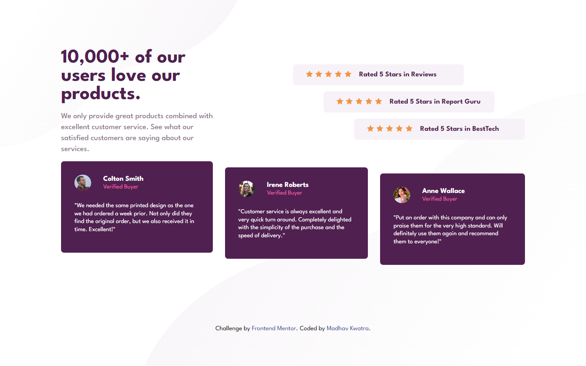
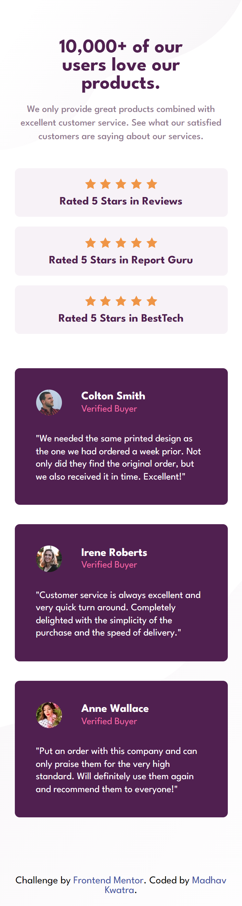

# Frontend Mentor - Social proof section solution

This is a solution to the [Social proof section challenge on Frontend Mentor](https://www.frontendmentor.io/challenges/social-proof-section-6e0qTv_bA). Frontend Mentor challenges help you improve your coding skills by building realistic projects.

## Table of contents

- [Overview](#overview)
  - [The challenge](#the-challenge)
  - [Screenshot](#screenshot)
  - [Links](#links)
  - [Built with](#built-with)
  - [Useful resources](#useful-resources)
- [Author](#author)

## Overview

Solved a challenge from frontendmentor.io.

### The challenge

Users should be able to:

- View the optimal layout for the section depending on their device's screen size

### Screenshot

DESKTOP

MOBILE

### Links

- Solution URL: [Github Repo](https://github.com/MadhavKwatra/frontendmentor-social-proof-section)
- Live Site URL: [Github Page](https://madhavkwatra.github.io/frontendmentor-social-proof-section/)

### Built with

- Flexbox
- Mobile-first workflow
- [SCSS](https://sass-lang.com/)

### Useful resources

- [MDN Background Reference](https://developer.mozilla.org/en-US/docs/Web/CSS/background) - This helped me for adding the bg-pattern to the website. I really liked this pattern and will use it going forward.

## Author

<!-- - Website - [Madhav Kwatra](https://www.your-site.com) -->

- Frontend Mentor - [@MadhavKwatra](https://www.frontendmentor.io/profile/MadhavKwatra)
- Twitter - [@madhav_kwatra](https://www.twitter.com/madhav_kwatra)
